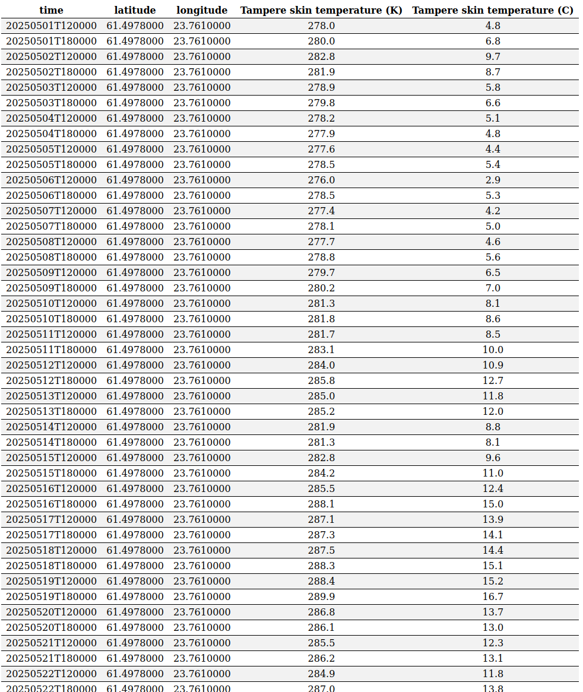
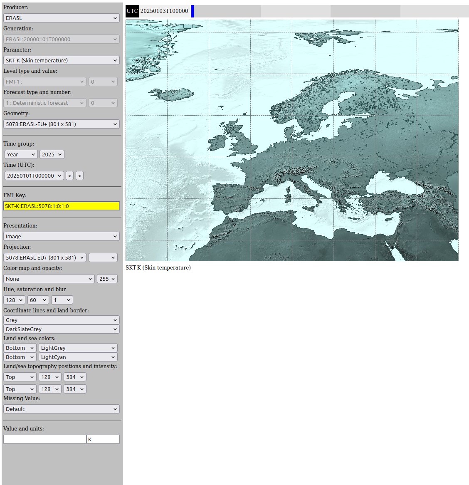
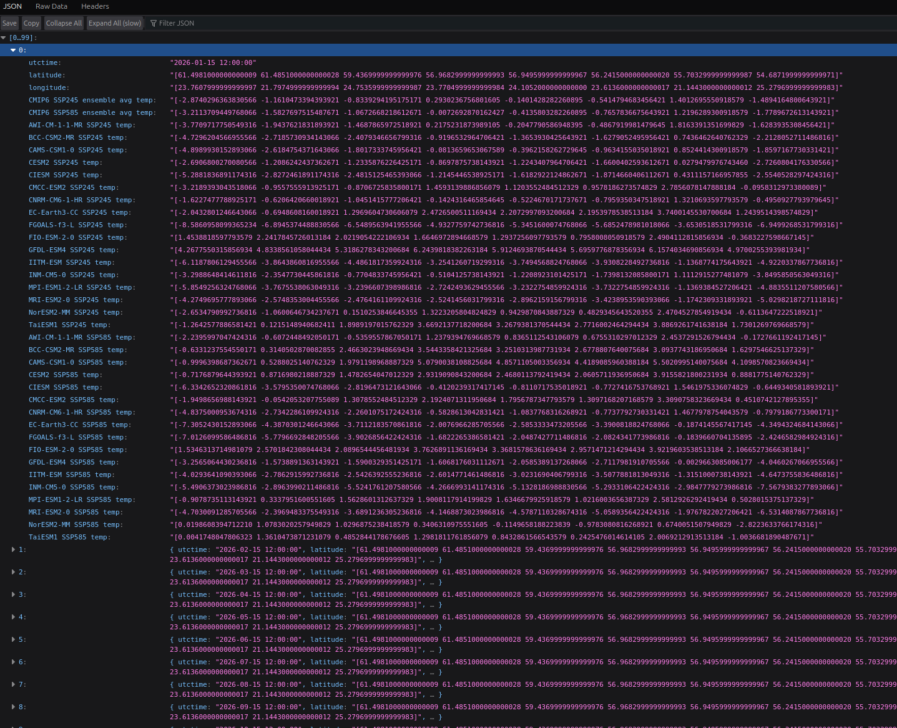

# SmartMet-server for AURORA Clima project

## Table of Contents

1. [Overview](#overview)
2. [Data Available for the AURORA Clima Project](#data-available-for-the-aurora-clima-projectdata-available-for-the-aurora-clima-project)
   - [Producers](#producers)
   - [Variables](#variables)
   - [Climate Projection Models](#climate-projection-models)
3. [Using the Timeseries API](#using-the-timeseries-api)
   - [CMIP6 Data Timeseries Retrieval](#cmip6-data-timeseries-retrieval)
4. [Using the WMS/Dali Plugin for Images](#using-the-wmsdali-plugin-for-images)
5. [OGC EDR Environmental Data Retrieval](#ogc-edr-environmental-data-retrieval)

## Overview

SmartMet Server is a data and product server which provides acces to both observation and forecast data. It is used for data services and product generation. Smartmet Server can read input from various sources and it provides several ouput interfaces and formats. For more detailed description, see the [SmartMet Server wiki pages](https://github.com/fmidev/smartmet-server/wiki). The setup used for AURORA is the same as in https://github.com/fmidev/harvesterseasons-smartmet/ installed in two different machines based on sponsored computing resources from WEkEO and EuroHPC.

SmartMet Server purpose is a service to make data available directly to web apps without needing any data downloading and processing steps on a server. You can directly write javascript web apps to use Copernicus data. To get a feel for the data offered, go to https://urban.geoss.space/grid-gui . This is a general data browser. This service has datasets from several producers (f.ex. currently working: CMIP6-ssp245, ERA5, ECENS, ECSF, ECBSF). 

For example web app code using a smartmet-server check out the https://github.com/fmidev/harvesterseasons-site repository and check out the service https://harvesterseasons.com.

## Data available for the AURORA Clima project
This is the place for meteorological model data to be used in AURORA. SmartMet-servers build the route to data via a hierarchy of producer-generation-variable

### Producers
ERA5 reanalysis data is available for analysing past conditions and building training data for machine learning. Generations 2000-01-01 and 1995-01-01 are available with the latter extending to 5 more years of data into the past. ERA5 is updated every day for the situation from 5 days ago.

ECENS is the producer for weather forecast ensembles from the ECMWF model for 15-day forecasts.

ECSF and ECBSF seasonal forecasts are available once per month for 215 daily forecasts (~7 months) ahead. 

In addition there will be a highresolution (1km or better) temperature product from the producer AURORA as the result from the ML model to reveal Urban Heat Islands.

All original data was ingested from the Copernicus Climate Change Service C3S data store or processed by FMI on-site. To utilize datasets shown on this service, the SmartMet Server TimeSeries plugin can be used.

Provenance table:
|Producer|C3S data set|Url to grid-gui|Url to dataset|
|:-|:-|:-|:-|
|ERA5|Copernicus C3S|[grid-gui ERA5](https://urban.geoss.space/grid-gui?session=bl=1;cl=Grey;cm=Temperature%20(240K..341K);f=;fn=;ft=;g=12;gm=;hu=128;k=T2-K:ECBSF:5022:1:0:1:0;l=;lb=DarkSlateGrey;lcp=1;lm=LightGrey;lsl=128;lsp=2;lss=384;lt=;m=0;max=64;mi=Default;min=2;op=255;p=;pg=main;pi=11;pl=;pn=ERA5;pre=Image;pro=;sa=60;sc=DarkSlateGrey;scp=1;sm=LightCyan;ssl=128;ssp=2;sss=384;st=14;t=;tg=;tgt=Year;u=;xx=;yy=;&p=T2-K)|[C3S reanalysis-era5-single-levels](https://cds.climate.copernicus.eu/datasets/reanalysis-era5-single-levels-timeseriesdatasets/)|
|ECENS|ECMWF ensemble forecasts|[grid-gui ECENS](https://urban.geoss.space/grid-gui?session=bl=1;cl=Grey;cm=Temperature%20(240K..341K);f=;fn=;ft=;g=758;gm=;hu=128;k=T2-K:ECBSF:5022:1:0:1:0;l=;lb=DarkSlateGrey;lcp=1;lm=LightGrey;lsl=128;lsp=2;lss=384;lt=;m=0;max=64;mi=Default;min=2;op=255;p=;pg=main;pi=21;pl=;pn=ECENS;pre=Image;pro=;sa=60;sc=DarkSlateGrey;scp=1;sm=LightCyan;ssl=128;ssp=2;sss=384;st=14;t=;tg=;tgt=Year;u=;xx=;yy=;&p=T2-K)|[ECMWF forecasts description](https://www.ecmwf.int/en/forecasts/datasets/set-iii)|
|ECSF|C3S seasonal forecasts|[grid-gui ECSF](https://urban.geoss.space/grid-gui?session=bl=1;cl=Grey;cm=Temperature%20(240K..341K);f=;fn=;ft=;g=752;gm=;hu=128;k=T2-K:ECBSF:5022:1:0:1:0;l=;lb=DarkSlateGrey;lcp=1;lm=LightGrey;lsl=128;lsp=2;lss=384;lt=;m=0;max=64;mi=Default;min=2;op=255;p=;pg=main;pi=18;pl=;pn=ECSF;pre=Image;pro=;sa=60;sc=DarkSlateGrey;scp=1;sm=LightCyan;ssl=128;ssp=2;sss=384;st=14;t=;tg=;tgt=Year;u=;xx=;yy=;&p=T2-K)|[C3S seasonal-postprocessed-single-levels](https://cds.climate.copernicus.eu/datasets/seasonal-postprocessed-single-levels)|
|ECBSF|C3S bias-adjusted seasonal forecasts|[grid-gui ECBSF](https://urban.geoss.space/grid-gui?session=bl=1;cl=Grey;cm=Temperature%20(240K..341K);f=;fn=;ft=;g=751;gm=;hu=128;k=T2-K:ECBSF:5022:1:0:1:0;l=;lb=DarkSlateGrey;lcp=1;lm=LightGrey;lsl=128;lsp=2;lss=384;lt=;m=0;max=64;mi=Default;min=2;op=255;p=;pg=main;pi=19;pl=;pn=ECBSF;pre=Image;pro=;sa=60;sc=DarkSlateGrey;scp=1;sm=LightCyan;ssl=128;ssp=2;sss=384;st=14;t=;tg=;tgt=Year;u=;xx=;yy=;&p=T2-K)|[C3S dataset as above](https://cds.climate.copernicus.eu/datasets/seasonal-postprocessed-single-levels)|
|CMIP6-ssp245 CMIP6-ssp585|CMIP6 bias-adjusted projections|[grid-gui CMIP6-ssp245](https://urban.geoss.space/grid-gui?session=bl=1;cl=Grey;cm=Temperature%20(240K..341K);f=41934;fn=1;ft=3;g=760;gm=5093;hu=128;k=T2-K:CMIP6-ssp245:5093:4:2:3:1;l=2;lb=DarkSlateGrey;lcp=1;lm=LightGrey;lsl=128;lsp=2;lss=384;lt=4;m=131;max=64;mi=Default;min=2;op=255;p=T2-K;pg=main;pi=50;pl=;pn=CMIP6-ssp245;pre=Image;pro=5093;sa=60;sc=DarkSlateGrey;scp=1;sm=LightCyan;ssl=128;ssp=2;sss=384;st=14;t=20260113T120000;tg=2026;tgt=Year;u=;xx=;yy=;&t=20260213T120000&f=41934&m=132&ft=3&fn=1)|[C3S projections-cmip6](https://cds.climate.copernicus.eu/datasets/projections-cmip6)|

### Variables

Aurora analysis has chosen these variables to be available from each source:
- evaporation
- total precipitation
- wind speed
- 2m air temperature (+ min/max daily temperatures)
- relative humidity
- sea level pressure

The time scales available are mostly daily and for climate predictions monthly.
Tallinn also requested for sea surface temperature and sea surface height.

### Climate projection models

20 models were fetched to be bias-adjusted/downscaled with ERA5 over the period 1995 to 2024. 
The script doing the bias-adjustment is . 
First climate model historical data 1995-2014 are merged with ssp245 data 2015-2024. This data is then substracted with ERA5 timeseries of the same period at monthly time steps. Finally bias is added to both ssp245 and ssp585 projections and the models are combined as an ensemble for each scenario. 
Unfortunately not all models had ssp245 projections hence 3 models dropped completely out. Also not all variables were available from all models. Hence ensembles vary in size and the forecast number identifying models is the same only for AWI, BCC and CAMS models. The other models have numbers depending on the earlier models missing in the list. The numbers can be addressed to models according to this table.

| Model | evaporation - evspsbl | relative humidity - hur | precipitation - pr | sea level pressure - psl | wind speed at 10m - sfcWind | air temperature at 2m - tas | minimum tas - mn2t24 | maximum tas - mx2t24 |
|-------|-------|-------|-------|-------|-------|-------|-------|-------|
| AWI-CM-1-1-MR | 1 | 1 | 1 | 1 | 1 | 1 | 1 | 1 |
| BCC-CSM2-MR | 2 | - | 2 | 2 | 2 | 2 | 2 | 2 |
| CAMS-CSM1-0 | - | - | 3 | 3 | - | 3 | - | - |
| CESM2 | 3 | 2 | 4 | 4 | 3 | 4 | 3 | 3 |
| CIESM | - | - | - | - | - | 5 | 4 | 4 |
| CMCC-ESM2 | 4 | 3 | 5 | 5 | 4 | 6 | 5 | 5 |
| CNRM-CM6-1-HR | 5 | 4 | 6 | 6 | 5 | 7 | 6 | 6 |
| EC-Earth3-CC | 6 | 5 | 7 | 7 | 6 | 8 | 7 | 7 |
| FGOALS-f3-L | 7 | - | 8 | 8 | 7 | 9 | - | - |
| FIO-ESM-2-0 | 8 | 6 | 9 | 9 | 8 | 10 | 8 | 8 |
| GFDL-ESM4 | 9 | 7 | 10 | 10 | 9 | 11 | 9 | 9 |
| IITM-ESM | 10 | - | 11 | 11 | 10 | 12 | - | - |
| INM-CM5-0 | 11 | 8 | 12 | 12 | 11 | 13 | 10 | 10 |
| MPI-ESM1-2-LR | 12 | 9 | 13 | 13 | 12 | 14 | 11 | 11 |
| MRI-ESM2-0 | 13 | - | 14 | 14 | 13 | 15 | 12 | 12 |
| NorESM2-MM | 14 | - | 15 | 15 | 14 | 16 | - | - |
| TaiESM1 | 15 | 10 | 16 | 16 | 15 | 17 | - | - |

## Using the Timeseries API for retrieving data in table format

The TimeSeries plugin can be used to fetch time series information for observation and forecast data, with specific time or time interval chosen by the user. The datasets can be downloaded with a HTTP request which contains the parameters needed to obtain the information, processing the results and formatting the output.
For example, the following simple request fetches the Skin temperature in Kelvins and Celsius for Tampere (1.5.2025-1.7.2025 for hours 12 and 18 daily):

[https://urban.geoss.space/timeseries?latlon=61.4978,23.7610&format=debug&param=time,latitude,longitude,SKT-K:ERA5L:5078:1:0:1:0 as Tampere skin temperature (K),K2C{SKT-K:ERA5L:5078:1:0:1:0} as Tampere skin temperature (C)&starttime=20250501T000000&endtime=20250701T000000&hour=12,18&precision=double](https://urban.geoss.space/timeseries?latlon=61.4978,23.7610&format=debug&param=time,latitude,longitude,SKT-K:ERA5L:5078:1:0:1:0%20as%20Tampere%20skin%20temperature%20(K),K2C{SKT-K:ERA5L:5078:1:0:1:0}%20as%20Tampere%20skin%20temperature%20(C)&starttime=20250501T000000&endtime=20250701T000000&hour=12,18&precision=double)

The service location that starts the HTTP request query is **urban.geoss.space**, and the parameters following it are given as name-value pairs separated by the ampersand (&) character. Hint: copy the FMI key from the https://urban.geoss.space/grid-gui service for the parameter definition 'param'. Here SKT-K:ERA5L:5078:1:0:1:0 is the fmi-key (highlighted with yellow in below Grid-GUI figure) but we have renamed the columns in the output to whatever we want. Here, output format is `debug` but there are several options, f.ex. `json` or `csv` (latter will download csv file directly).

An example response for this query is shown below: 

FMI-key can be copied from Grid-GUI (yellow)

For more information and examples of the usage of the TimeSeries plugin, see SmartMet Server [Timeseries-plugin Wiki pages](https://github.com/fmidev/smartmet-plugin-timeseries/wiki) or [Simplified Documentation for CryoSCOPE project](https://github.com/fmidev/cryoscope-smart/blob/main/README.md) 

### CMIP6 data Timeseries retrieval 

Example City Coordinates and Bounding Boxes (from Claude, not verified!)

| City | Country | Lat | Lon | BBox (min_lon, min_lat, max_lon, max_lat) |
|---|---|---|---|---|
| Vilnius | Lithuania | 54.6872 | 25.2797 | 25.02, 54.56, 25.50, 54.80 |
| Klaipėda | Lithuania | 55.7033 | 21.1443 | 21.05, 55.65, 21.27, 55.75 |
| Joniškis | Lithuania | 56.2415 | 23.6136 | 23.55, 56.21, 23.68, 56.27 |
| Riga | Latvia | 56.9496 | 24.1052 | 23.97, 56.87, 24.32, 57.08 |
| Jūrmala | Latvia | 56.9683 | 23.7705 | 23.57, 56.93, 23.97, 57.01 |
| Tallinn | Estonia | 59.4370 | 24.7536 | 24.55, 59.35, 24.92, 59.52 |
| Pori | Finland | 61.4851 | 21.7975 | 21.65, 61.42, 21.95, 61.55 |
| Tampere | Finland | 61.4978 | 23.7610 | 23.58, 61.42, 23.95, 61.57 |

Here is an example call to retrieve average monthly temperature in degrees Celsius CMIP6 SSP245 and SSP585 scenarios for all cities (points) from 2026 to 2036 for all models, renaming columns (model names corresponding to forecast numbers e.g. last number in FMI-key can be seen from grib file names if you choose "Presentation: Info" in grid-gui view):

[https://urban.geoss.space/timeseries?latlons=61.4981,23.7608,61.4851,21.7975,59.4370,24.7536,56.9683,23.7705,56.9496,24.1052,56.2415,23.6136,55.7033,21.1443,54.6872,25.2797&param=utctime,latitude,longitude,K2C{AVG{T2-K:CMIP6-ssp585:5093:4:2:3:1-17}} as CMIP6 SSP245 ensemble avg temp,K2C{AVG{T2-K:CMIP6-ssp245:5093:4:2:3:1-17}} as CMIP6 SSP585 ensemble avg temp,K2C{T2-K:CMIP6-ssp245:5093:4:2:3:1} as AWI-CM-1-1-MR SSP245 temp,K2C{T2-K:CMIP6-ssp245:5093:4:2:3:2} as BCC-CSM2-MR SSP245 temp,K2C{T2-K:CMIP6-ssp245:5093:4:2:3:3} as CAMS-CSM1-0 SSP245 temp,K2C{T2-K:CMIP6-ssp245:5093:4:2:3:4} as CESM2 SSP245 temp,K2C{T2-K:CMIP6-ssp245:5093:4:2:3:5} as CIESM SSP245 temp,K2C{T2-K:CMIP6-ssp245:5093:4:2:3:6} as CMCC-ESM2 SSP245 temp,K2C{T2-K:CMIP6-ssp245:5093:4:2:3:7} as CNRM-CM6-1-HR SSP245 temp,K2C{T2-K:CMIP6-ssp245:5093:4:2:3:8} as EC-Earth3-CC SSP245 temp,K2C{T2-K:CMIP6-ssp245:5093:4:2:3:9} as FGOALS-f3-L SSP245 temp,K2C{T2-K:CMIP6-ssp245:5093:4:2:3:10} as FIO-ESM-2-0 SSP245 temp,K2C{T2-K:CMIP6-ssp245:5093:4:2:3:11} as GFDL-ESM4 SSP245 temp,K2C{T2-K:CMIP6-ssp245:5093:4:2:3:12} as IITM-ESM SSP245 temp,K2C{T2-K:CMIP6-ssp245:5093:4:2:3:13} as INM-CM5-0 SSP245 temp,K2C{T2-K:CMIP6-ssp245:5093:4:2:3:14} as MPI-ESM1-2-LR SSP245 temp,K2C{T2-K:CMIP6-ssp245:5093:4:2:3:15} as MRI-ESM2-0 SSP245 temp,K2C{T2-K:CMIP6-ssp245:5093:4:2:3:16} as NorESM2-MM SSP245 temp,K2C{T2-K:CMIP6-ssp245:5093:4:2:3:17} as TaiESM1 SSP245 temp,K2C{T2-K:CMIP6-ssp585:5093:4:2:3:1} as AWI-CM-1-1-MR SSP585 temp,K2C{T2-K:CMIP6-ssp585:5093:4:2:3:2} as BCC-CSM2-MR SSP585 temp,K2C{T2-K:CMIP6-ssp585:5093:4:2:3:3} as CAMS-CSM1-0 SSP585 temp,K2C{T2-K:CMIP6-ssp585:5093:4:2:3:4} as CESM2 SSP585 temp,K2C{T2-K:CMIP6-ssp585:5093:4:2:3:5} as CIESM SSP585 temp,K2C{T2-K:CMIP6-ssp585:5093:4:2:3:6} as CMCC-ESM2 SSP585 temp,K2C{T2-K:CMIP6-ssp585:5093:4:2:3:7} as CNRM-CM6-1-HR SSP585 temp,K2C{T2-K:CMIP6-ssp585:5093:4:2:3:8} as EC-Earth3-CC SSP585 temp,K2C{T2-K:CMIP6-ssp585:5093:4:2:3:9} as FGOALS-f3-L SSP585 temp,K2C{T2-K:CMIP6-ssp585:5093:4:2:3:10} as FIO-ESM-2-0 SSP585 temp,K2C{T2-K:CMIP6-ssp585:5093:4:2:3:11} as GFDL-ESM4 SSP585 temp,K2C{T2-K:CMIP6-ssp585:5093:4:2:3:12} as IITM-ESM SSP585 temp,K2C{T2-K:CMIP6-ssp585:5093:4:2:3:13} as INM-CM5-0 SSP585 temp,K2C{T2-K:CMIP6-ssp585:5093:4:2:3:14} as MPI-ESM1-2-LR SSP585 temp,K2C{T2-K:CMIP6-ssp585:5093:4:2:3:15} as MRI-ESM2-0 SSP585 temp,K2C{T2-K:CMIP6-ssp585:5093:4:2:3:16} as NorESM2-MM SSP585 temp,K2C{T2-K:CMIP6-ssp585:5093:4:2:3:17} as TaiESM1 SSP585 temp&starttime=20260113T120000Z&endtime=20361213T120000Z&hour=12&format=json&precision=full&tz=utc&timeformat=sql&origintime=20150101T000000Z&day=15&grouplocations=1](https://urban.geoss.space/timeseries?latlons=61.4981,23.7608,61.4851,21.7975,59.4370,24.7536,56.9683,23.7705,56.9496,24.1052,56.2415,23.6136,55.7033,21.1443,54.6872,25.2797&param=utctime,latitude,longitude,K2C{AVG{T2-K:CMIP6-ssp585:5093:4:2:3:1-17}}%20as%20CMIP6%20SSP245%20ensemble%20avg%20temp,K2C{AVG{T2-K:CMIP6-ssp245:5093:4:2:3:1-17}}%20as%20CMIP6%20SSP585%20ensemble%20avg%20temp,K2C{T2-K:CMIP6-ssp245:5093:4:2:3:1}%20as%20AWI-CM-1-1-MR%20SSP245%20temp,K2C{T2-K:CMIP6-ssp245:5093:4:2:3:2}%20as%20BCC-CSM2-MR%20SSP245%20temp,K2C{T2-K:CMIP6-ssp245:5093:4:2:3:3}%20as%20CAMS-CSM1-0%20SSP245%20temp,K2C{T2-K:CMIP6-ssp245:5093:4:2:3:4}%20as%20CESM2%20SSP245%20temp,K2C{T2-K:CMIP6-ssp245:5093:4:2:3:5}%20as%20CIESM%20SSP245%20temp,K2C{T2-K:CMIP6-ssp245:5093:4:2:3:6}%20as%20CMCC-ESM2%20SSP245%20temp,K2C{T2-K:CMIP6-ssp245:5093:4:2:3:7}%20as%20CNRM-CM6-1-HR%20SSP245%20temp,K2C{T2-K:CMIP6-ssp245:5093:4:2:3:8}%20as%20EC-Earth3-CC%20SSP245%20temp,K2C{T2-K:CMIP6-ssp245:5093:4:2:3:9}%20as%20FGOALS-f3-L%20SSP245%20temp,K2C{T2-K:CMIP6-ssp245:5093:4:2:3:10}%20as%20FIO-ESM-2-0%20SSP245%20temp,K2C{T2-K:CMIP6-ssp245:5093:4:2:3:11}%20as%20GFDL-ESM4%20SSP245%20temp,K2C{T2-K:CMIP6-ssp245:5093:4:2:3:12}%20as%20IITM-ESM%20SSP245%20temp,K2C{T2-K:CMIP6-ssp245:5093:4:2:3:13}%20as%20INM-CM5-0%20SSP245%20temp,K2C{T2-K:CMIP6-ssp245:5093:4:2:3:14}%20as%20MPI-ESM1-2-LR%20SSP245%20temp,K2C{T2-K:CMIP6-ssp245:5093:4:2:3:15}%20as%20MRI-ESM2-0%20SSP245%20temp,K2C{T2-K:CMIP6-ssp245:5093:4:2:3:16}%20as%20NorESM2-MM%20SSP245%20temp,K2C{T2-K:CMIP6-ssp245:5093:4:2:3:17}%20as%20TaiESM1%20SSP245%20temp,K2C{T2-K:CMIP6-ssp585:5093:4:2:3:1}%20as%20AWI-CM-1-1-MR%20SSP585%20temp,K2C{T2-K:CMIP6-ssp585:5093:4:2:3:2}%20as%20BCC-CSM2-MR%20SSP585%20temp,K2C{T2-K:CMIP6-ssp585:5093:4:2:3:3}%20as%20CAMS-CSM1-0%20SSP585%20temp,K2C{T2-K:CMIP6-ssp585:5093:4:2:3:4}%20as%20CESM2%20SSP585%20temp,K2C{T2-K:CMIP6-ssp585:5093:4:2:3:5}%20as%20CIESM%20SSP585%20temp,K2C{T2-K:CMIP6-ssp585:5093:4:2:3:6}%20as%20CMCC-ESM2%20SSP585%20temp,K2C{T2-K:CMIP6-ssp585:5093:4:2:3:7}%20as%20CNRM-CM6-1-HR%20SSP585%20temp,K2C{T2-K:CMIP6-ssp585:5093:4:2:3:8}%20as%20EC-Earth3-CC%20SSP585%20temp,K2C{T2-K:CMIP6-ssp585:5093:4:2:3:9}%20as%20FGOALS-f3-L%20SSP585%20temp,K2C{T2-K:CMIP6-ssp585:5093:4:2:3:10}%20as%20FIO-ESM-2-0%20SSP585%20temp,K2C{T2-K:CMIP6-ssp585:5093:4:2:3:11}%20as%20GFDL-ESM4%20SSP585%20temp,K2C{T2-K:CMIP6-ssp585:5093:4:2:3:12}%20as%20IITM-ESM%20SSP585%20temp,K2C{T2-K:CMIP6-ssp585:5093:4:2:3:13}%20as%20INM-CM5-0%20SSP585%20temp,K2C{T2-K:CMIP6-ssp585:5093:4:2:3:14}%20as%20MPI-ESM1-2-LR%20SSP585%20temp,K2C{T2-K:CMIP6-ssp585:5093:4:2:3:15}%20as%20MRI-ESM2-0%20SSP585%20temp,K2C{T2-K:CMIP6-ssp585:5093:4:2:3:16}%20as%20NorESM2-MM%20SSP585%20temp,K2C{T2-K:CMIP6-ssp585:5093:4:2:3:17}%20as%20TaiESM1%20SSP585%20temp&starttime=20260113T120000Z&endtime=20361213T120000Z&hour=12&format=json&precision=full&tz=utc&timeformat=sql&origintime=20150101T000000Z&day=15&grouplocations=1)

Output from this looks like: 

Note that if you want to fetch data for one single location (lat,lon pair) per request, use `latlon` instead of `latlons`in HTTP query. You can also request data for area defined by `bbox`, simple `bbox` example below for Tampere (note that order is lon1,lat1,lon2,lat2) which returns data for all available grid points inside given bounding box: 

`https://urban.geoss.space/timeseries?bbox=23.58,61.42,23.95,61.57&format=json&param=time,latitude,longitude,SKT-K:ERA5L:5078:1:0:1:0%20as%20Tampere%20skin%20temperature%20(K),K2C{SKT-K:ERA5L:5078:1:0:1:0}%20as%20Tampere%20skin%20temperature%20(C)&starttime=20250501T000000&endtime=20250701T000000&hour=12,18&precision=double`

#### Example CMIP6 SSP245 Average monthly temperature [degrees Celsius]

Here are calls for each CMIP6 variable that returns a csv file for the 2024 to 2099 years:
- T2-K average temperature: [https://urban.geoss.space/timeseries?latlon=61.4981,23.7608&param=utctime,latitude,longitude,median(T2-K:CMIP6-ssp245:5093::::1-17),T2-K:CMIP6-ssp245:5093:4:2:3:1,T2-K:CMIP6-ssp245:5093:4:2:3:2,T2-K:CMIP6-ssp245:5093:4:2:3:3,T2-K:CMIP6-ssp245:5093:4:2:3:4,T2-K:CMIP6-ssp245:5093:4:2:3:5,T2-K:CMIP6-ssp245:5093:4:2:3:6,T2-K:CMIP6-ssp245:5093:4:2:3:7,T2-K:CMIP6-ssp245:5093:4:2:3:8,T2-K:CMIP6-ssp245:5093:4:2:3:9,T2-K:CMIP6-ssp245:5093:4:2:3:10,T2-K:CMIP6-ssp245:5093:4:2:3:11,T2-K:CMIP6-ssp245:5093:4:2:3:12,T2-K:CMIP6-ssp245:5093:4:2:3:13,T2-K:CMIP6-ssp245:5093:4:2:3:14,T2-K:CMIP6-ssp245:5093:4:2:3:15,T2-K:CMIP6-ssp245:5093:4:2:3:16,T2-K:CMIP6-ssp245:5093:4:2:3:17&starttime=20240115T000000Z&endtime=20991231T000000Z&timestep=1440&format=csv&precision=double&tz=utc&timeformat=sql&origintime=20000101T000000Z&day=15](https://urban.geoss.space/timeseries?latlon=61.4981,23.7608&param=utctime,latitude,longitude,median(T2-K:CMIP6-ssp245:5093::::1-17),T2-K:CMIP6-ssp245:5093:4:2:3:1,T2-K:CMIP6-ssp245:5093:4:2:3:2,T2-K:CMIP6-ssp245:5093:4:2:3:3,T2-K:CMIP6-ssp245:5093:4:2:3:4,T2-K:CMIP6-ssp245:5093:4:2:3:5,T2-K:CMIP6-ssp245:5093:4:2:3:6,T2-K:CMIP6-ssp245:5093:4:2:3:7,T2-K:CMIP6-ssp245:5093:4:2:3:8,T2-K:CMIP6-ssp245:5093:4:2:3:9,T2-K:CMIP6-ssp245:5093:4:2:3:10,T2-K:CMIP6-ssp245:5093:4:2:3:11,T2-K:CMIP6-ssp245:5093:4:2:3:12,T2-K:CMIP6-ssp245:5093:4:2:3:13,T2-K:CMIP6-ssp245:5093:4:2:3:14,T2-K:CMIP6-ssp245:5093:4:2:3:15,T2-K:CMIP6-ssp245:5093:4:2:3:16,T2-K:CMIP6-ssp245:5093:4:2:3:17&starttime=20240115T000000Z&endtime=20991231T000000Z&timestep=1440&format=csv&precision=double&tz=utc&timeformat=sql&origintime=20000101T000000Z&day=15)

#### Example CMIP6 SSP245 Average monthly maximum temperature [degrees Celsius]

- TMAX-24-K average temperature: [https://urban.geoss.space/timeseries?latlon=61.4981,23.7608&param=utctime,latitude,longitude,median(TMAX-24-K:CMIP6-ssp245:5093::::1-15),TMAX-24-K:CMIP6-ssp245:5093:::3:1,TMAX-24-K:CMIP6-ssp245:5093:::3:2,TMAX-24-K:CMIP6-ssp245:5093:::3:3,TMAX-24-K:CMIP6-ssp245:5093:::3:4,TMAX-24-K:CMIP6-ssp245:5093:::3:5,TMAX-24-K:CMIP6-ssp245:5093:::3:6,TMAX-24-K:CMIP6-ssp245:5093:::3:7,TMAX-24-K:CMIP6-ssp245:5093:::3:8,TMAX-24-K:CMIP6-ssp245:5093:::3:9,TMAX-24-K:CMIP6-ssp245:5093:::3:10,TMAX-24-K:CMIP6-ssp245:5093:::3:11,TMAX-24-K:CMIP6-ssp245:5093:::3:12&starttime=20240115T000000Z&endtime=20991231T000000Z&timestep=1440&format=csv&precision=double&tz=utc&timeformat=sql&origintime=20000101T000000Z&day=15](https://urban.geoss.space/timeseries?latlon=61.4981,23.7608&param=utctime,latitude,longitude,median(TMAX-24-K:CMIP6-ssp245:5093::::1-15),TMAX-24-K:CMIP6-ssp245:5093:::3:1,TMAX-24-K:CMIP6-ssp245:5093:::3:2,TMAX-24-K:CMIP6-ssp245:5093:::3:3,TMAX-24-K:CMIP6-ssp245:5093:::3:4,TMAX-24-K:CMIP6-ssp245:5093:::3:5,TMAX-24-K:CMIP6-ssp245:5093:::3:6,TMAX-24-K:CMIP6-ssp245:5093:::3:7,TMAX-24-K:CMIP6-ssp245:5093:::3:8,TMAX-24-K:CMIP6-ssp245:5093:::3:9,TMAX-24-K:CMIP6-ssp245:5093:::3:10,TMAX-24-K:CMIP6-ssp245:5093:::3:11,TMAX-24-K:CMIP6-ssp245:5093:::3:12&starttime=20240115T000000Z&endtime=20991231T000000Z&timestep=1440&format=csv&precision=double&tz=utc&timeformat=sql&origintime=20000101T000000Z&day=15)
- TMIN-24-K average temperature: [https://urban.geoss.space/timeseries?latlon=61.4981,23.7608&param=utctime,latitude,longitude,median(TMIN-24-K:CMIP6-ssp245:5093::::1-15),TMIN-24-K:CMIP6-ssp245:5093:::3:1,TMIN-24-K:CMIP6-ssp245:5093:::3:2,TMIN-24-K:CMIP6-ssp245:5093:::3:3,TMIN-24-K:CMIP6-ssp245:5093:::3:4,TMIN-24-K:CMIP6-ssp245:5093:::3:5,TMIN-24-K:CMIP6-ssp245:5093:::3:6,TMIN-24-K:CMIP6-ssp245:5093:::3:7,TMIN-24-K:CMIP6-ssp245:5093:::3:8,TMIN-24-K:CMIP6-ssp245:5093:::3:9,TMIN-24-K:CMIP6-ssp245:5093:::3:10,TMIN-24-K:CMIP6-ssp245:5093:::3:11,TMIN-24-K:CMIP6-ssp245:5093:::3:12&starttime=20240115T000000Z&endtime=20991231T000000Z&timestep=1440&format=csv&precision=double&tz=utc&timeformat=sql&origintime=20000101T000000Z&day=15](https://urban.geoss.space/timeseries?latlon=61.4981,23.7608&param=utctime,latitude,longitude,median(TMIN-24-K:CMIP6-ssp245:5093::::1-15),TMIN-24-K:CMIP6-ssp245:5093:::3:1,TMIN-24-K:CMIP6-ssp245:5093:::3:2,TMIN-24-K:CMIP6-ssp245:5093:::3:3,TMIN-24-K:CMIP6-ssp245:5093:::3:4,TMIN-24-K:CMIP6-ssp245:5093:::3:5,TMIN-24-K:CMIP6-ssp245:5093:::3:6,TMIN-24-K:CMIP6-ssp245:5093:::3:7,TMIN-24-K:CMIP6-ssp245:5093:::3:8,TMIN-24-K:CMIP6-ssp245:5093:::3:9,TMIN-24-K:CMIP6-ssp245:5093:::3:10,TMIN-24-K:CMIP6-ssp245:5093:::3:11,TMIN-24-K:CMIP6-ssp245:5093:::3:12&starttime=20240115T000000Z&endtime=20991231T000000Z&timestep=1440&format=csv&precision=double&tz=utc&timeformat=sql&origintime=20000101T000000Z&day=15)
- FF-MS average wind speed: [https://urban.geoss.space/timeseries?latlon=61.4981,23.7608&param=utctime,latitude,longitude,median(TMIN-24-K:CMIP6-ssp245:5093:::3:1-15),FF-MS:CMIP6-ssp245:5093:::3:1,FF-MS:CMIP6-ssp245:5093:::3:2,FF-MS:CMIP6-ssp245:5093:::3:3,FF-MS:CMIP6-ssp245:5093:::3:4,FF-MS:CMIP6-ssp245:5093:::3:5,FF-MS:CMIP6-ssp245:5093:::3:6,FF-MS:CMIP6-ssp245:5093:::3:7,FF-MS:CMIP6-ssp245:5093:::3:8,FF-MS:CMIP6-ssp245:5093:::3:9,FF-MS:CMIP6-ssp245:5093:::3:10,FF-MS:CMIP6-ssp245:5093:::3:11,FF-MS:CMIP6-ssp245:5093:::3:12,FF-MS:CMIP6-ssp245:5093:::3:13,FF-MS:CMIP6-ssp245:5093:::3:14,FF-MS:CMIP6-ssp245:5093:::3:15&starttime=20240115T000000Z&endtime=20991231T000000Z&timestep=1440&format=csv&precision=double&tz=utc&timeformat=sql&origintime=20000101T000000Z&day=15](https://urban.geoss.space/timeseries?latlon=61.4981,23.7608&param=utctime,latitude,longitude,median(TMIN-24-K:CMIP6-ssp245:5093:::3:1-15),FF-MS:CMIP6-ssp245:5093:::3:1,FF-MS:CMIP6-ssp245:5093:::3:2,FF-MS:CMIP6-ssp245:5093:::3:3,FF-MS:CMIP6-ssp245:5093:::3:4,FF-MS:CMIP6-ssp245:5093:::3:5,FF-MS:CMIP6-ssp245:5093:::3:6,FF-MS:CMIP6-ssp245:5093:::3:7,FF-MS:CMIP6-ssp245:5093:::3:8,FF-MS:CMIP6-ssp245:5093:::3:9,FF-MS:CMIP6-ssp245:5093:::3:10,FF-MS:CMIP6-ssp245:5093:::3:11,FF-MS:CMIP6-ssp245:5093:::3:12,FF-MS:CMIP6-ssp245:5093:::3:13,FF-MS:CMIP6-ssp245:5093:::3:14,FF-MS:CMIP6-ssp245:5093:::3:15&starttime=20240115T000000Z&endtime=20991231T000000Z&timestep=1440&format=csv&precision=double&tz=utc&timeformat=sql&origintime=20000101T000000Z&day=15)
- PSEA-HPA average sea level pressure: [https://urban.geoss.space/timeseries?latlon=61.4981,23.7608&param=utctime,latitude,longitude,median(PSEA-HPA:CMIP6-ssp245:5093::::1-16),PSEA-HPA:CMIP6-ssp245:5093:4:2:3:1,PSEA-HPA:CMIP6-ssp245:5093:4:2:3:2,PSEA-HPA:CMIP6-ssp245:5093:4:2:3:3,PSEA-HPA:CMIP6-ssp245:5093:4:2:3:4,PSEA-HPA:CMIP6-ssp245:5093:4:2:3:5,PSEA-HPA:CMIP6-ssp245:5093:4:2:3:6,PSEA-HPA:CMIP6-ssp245:5093:4:2:3:7,PSEA-HPA:CMIP6-ssp245:5093:4:2:3:8,PSEA-HPA:CMIP6-ssp245:5093:4:2:3:9,PSEA-HPA:CMIP6-ssp245:5093:4:2:3:10,PSEA-HPA:CMIP6-ssp245:5093:4:2:3:11,PSEA-HPA:CMIP6-ssp245:5093:4:2:3:12,PSEA-HPA:CMIP6-ssp245:5093:4:2:3:13,PSEA-HPA:CMIP6-ssp245:5093:4:2:3:14,PSEA-HPA:CMIP6-ssp245:5093:4:2:3:15,PSEA-HPA:CMIP6-ssp245:5093:4:2:3:16&starttime=20240115T000000Z&endtime=20991231T000000Z&timestep=1440&format=csv&precision=double&tz=utc&timeformat=sql&origintime=20000101T000000Z&day=15](https://urban.geoss.space/timeseries?latlon=61.4981,23.7608&param=utctime,latitude,longitude,median(PSEA-HPA:CMIP6-ssp245:5093::::1-16),PSEA-HPA:CMIP6-ssp245:5093:4:2:3:1,PSEA-HPA:CMIP6-ssp245:5093:4:2:3:2,PSEA-HPA:CMIP6-ssp245:5093:4:2:3:3,PSEA-HPA:CMIP6-ssp245:5093:4:2:3:4,PSEA-HPA:CMIP6-ssp245:5093:4:2:3:5,PSEA-HPA:CMIP6-ssp245:5093:4:2:3:6,PSEA-HPA:CMIP6-ssp245:5093:4:2:3:7,PSEA-HPA:CMIP6-ssp245:5093:4:2:3:8,PSEA-HPA:CMIP6-ssp245:5093:4:2:3:9,PSEA-HPA:CMIP6-ssp245:5093:4:2:3:10,PSEA-HPA:CMIP6-ssp245:5093:4:2:3:11,PSEA-HPA:CMIP6-ssp245:5093:4:2:3:12,PSEA-HPA:CMIP6-ssp245:5093:4:2:3:13,PSEA-HPA:CMIP6-ssp245:5093:4:2:3:14,PSEA-HPA:CMIP6-ssp245:5093:4:2:3:15,PSEA-HPA:CMIP6-ssp245:5093:4:2:3:16&starttime=20240115T000000Z&endtime=20991231T000000Z&timestep=1440&format=csv&precision=double&tz=utc&timeformat=sql&origintime=20000101T000000Z&day=15)
- EREA-KGM2S1 average evaporation rate: [https://urban.geoss.space/timeseries?latlon=61.4981,23.7608&param=utctime,latitude,longitude,median(EREA-KGM2S1:CMIP6-ssp245:5093::::1-15),EREA-KGM2S1:CMIP6-ssp245:5093:4:2:3:1,EREA-KGM2S1:CMIP6-ssp245:5093:4:2:3:2,EREA-KGM2S1:CMIP6-ssp245:5093:4:2:3:3,EREA-KGM2S1:CMIP6-ssp245:5093:4:2:3:4,EREA-KGM2S1:CMIP6-ssp245:5093:4:2:3:5,EREA-KGM2S1:CMIP6-ssp245:5093:4:2:3:6,EREA-KGM2S1:CMIP6-ssp245:5093:4:2:3:7,EREA-KGM2S1:CMIP6-ssp245:5093:4:2:3:8,EREA-KGM2S1:CMIP6-ssp245:5093:4:2:3:9,EREA-KGM2S1:CMIP6-ssp245:5093:4:2:3:10,EREA-KGM2S1:CMIP6-ssp245:5093:4:2:3:11,EREA-KGM2S1:CMIP6-ssp245:5093:4:2:3:12,EREA-KGM2S1:CMIP6-ssp245:5093:4:2:3:13,EREA-KGM2S1:CMIP6-ssp245:5093:4:2:3:14,EREA-KGM2S1:CMIP6-ssp245:5093:4:2:3:15&starttime=20240115T000000Z&endtime=20991231T000000Z&timestep=1440&format=csv&precision=full&tz=utc&timeformat=sql&origintime=20000101T000000Z&day=15](https://urban.geoss.space/timeseries?latlon=61.4981,23.7608&param=utctime,latitude,longitude,median(EREA-KGM2S1:CMIP6-ssp245:5093::::1-15),EREA-KGM2S1:CMIP6-ssp245:5093:4:2:3:1,EREA-KGM2S1:CMIP6-ssp245:5093:4:2:3:2,EREA-KGM2S1:CMIP6-ssp245:5093:4:2:3:3,EREA-KGM2S1:CMIP6-ssp245:5093:4:2:3:4,EREA-KGM2S1:CMIP6-ssp245:5093:4:2:3:5,EREA-KGM2S1:CMIP6-ssp245:5093:4:2:3:6,EREA-KGM2S1:CMIP6-ssp245:5093:4:2:3:7,EREA-KGM2S1:CMIP6-ssp245:5093:4:2:3:8,EREA-KGM2S1:CMIP6-ssp245:5093:4:2:3:9,EREA-KGM2S1:CMIP6-ssp245:5093:4:2:3:10,EREA-KGM2S1:CMIP6-ssp245:5093:4:2:3:11,EREA-KGM2S1:CMIP6-ssp245:5093:4:2:3:12,EREA-KGM2S1:CMIP6-ssp245:5093:4:2:3:13,EREA-KGM2S1:CMIP6-ssp245:5093:4:2:3:14,EREA-KGM2S1:CMIP6-ssp245:5093:4:2:3:15&starttime=20240115T000000Z&endtime=20991231T000000Z&timestep=1440&format=csv&precision=full&tz=utc&timeformat=sql&origintime=20000101T000000Z&day=15)
- TPRATE-KGM2S1 average precipitation rate: [https://urban.geoss.space/timeseries?latlon=61.4981,23.7608&param=utctime,latitude,longitude,median(TPRATE-KGM2S1:CMIP6-ssp245:5093::::1-15),TPRATE-KGM2S1:CMIP6-ssp245:5093:1:0:3:1,TPRATE-KGM2S1:CMIP6-ssp245:5093:1:0:3:2,TPRATE-KGM2S1:CMIP6-ssp245:5093:1:0:3:3,TPRATE-KGM2S1:CMIP6-ssp245:5093:1:0:3:4,TPRATE-KGM2S1:CMIP6-ssp245:5093:1:0:3:5,TPRATE-KGM2S1:CMIP6-ssp245:5093:1:0:3:6,TPRATE-KGM2S1:CMIP6-ssp245:5093:1:0:3:7,TPRATE-KGM2S1:CMIP6-ssp245:5093:1:0:3:8,TPRATE-KGM2S1:CMIP6-ssp245:5093:1:0:3:9,TPRATE-KGM2S1:CMIP6-ssp245:5093:1:0:3:10,TPRATE-KGM2S1:CMIP6-ssp245:5093:1:0:3:11,TPRATE-KGM2S1:CMIP6-ssp245:5093:1:0:3:12,TPRATE-KGM2S1:CMIP6-ssp245:5093:1:0:3:13,TPRATE-KGM2S1:CMIP6-ssp245:5093:1:0:3:14,TPRATE-KGM2S1:CMIP6-ssp245:5093:1:0:3:15&starttime=20240115T000000Z&endtime=20991231T000000Z&timestep=1440&format=csv&precision=full&tz=utc&timeformat=sql&origintime=20000101T000000Z&day=15](https://urban.geoss.space/timeseries?latlon=61.4981,23.7608&param=utctime,latitude,longitude,median(TPRATE-KGM2S1:CMIP6-ssp245:5093::::1-15),TPRATE-KGM2S1:CMIP6-ssp245:5093:1:0:3:1,TPRATE-KGM2S1:CMIP6-ssp245:5093:1:0:3:2,TPRATE-KGM2S1:CMIP6-ssp245:5093:1:0:3:3,TPRATE-KGM2S1:CMIP6-ssp245:5093:1:0:3:4,TPRATE-KGM2S1:CMIP6-ssp245:5093:1:0:3:5,TPRATE-KGM2S1:CMIP6-ssp245:5093:1:0:3:6,TPRATE-KGM2S1:CMIP6-ssp245:5093:1:0:3:7,TPRATE-KGM2S1:CMIP6-ssp245:5093:1:0:3:8,TPRATE-KGM2S1:CMIP6-ssp245:5093:1:0:3:9,TPRATE-KGM2S1:CMIP6-ssp245:5093:1:0:3:10,TPRATE-KGM2S1:CMIP6-ssp245:5093:1:0:3:11,TPRATE-KGM2S1:CMIP6-ssp245:5093:1:0:3:12,TPRATE-KGM2S1:CMIP6-ssp245:5093:1:0:3:13,TPRATE-KGM2S1:CMIP6-ssp245:5093:1:0:3:14,TPRATE-KGM2S1:CMIP6-ssp245:5093:1:0:3:15&starttime=20240115T000000Z&endtime=20991231T000000Z&timestep=1440&format=csv&precision=full&tz=utc&timeformat=sql&origintime=20000101T000000Z&day=15)
- RH-PRCNT relative humidity: [https://urban.geoss.space/timeseries?latlon=61.4981,23.7608&param=utctime,latitude,longitude,median(RH-PRCNT:CMIP6-ssp245:5093::::1-16),RH-PRCNT:CMIP6-ssp245:5093:1:512:3:1,RH-PRCNT:CMIP6-ssp245:5093:1:512:3:2,RH-PRCNT:CMIP6-ssp245:5093:1:512:3:3,RH-PRCNT:CMIP6-ssp245:5093:1:512:3:4,RH-PRCNT:CMIP6-ssp245:5093:1:512:3:5,RH-PRCNT:CMIP6-ssp245:5093:1:512:3:6,RH-PRCNT:CMIP6-ssp245:5093:1:512:3:7,RH-PRCNT:CMIP6-ssp245:5093:1:512:3:8,RH-PRCNT:CMIP6-ssp245:5093:1:512:3:9,RH-PRCNT:CMIP6-ssp245:5093:1:512:3:10&starttime=20240115T000000Z&endtime=20991231T000000Z&timestep=1440&format=csv&precision=double&tz=utc&timeformat=sql&origintime=20000101T000000Z&day=15](https://urban.geoss.space/timeseries?latlon=61.4981,23.7608&param=utctime,latitude,longitude,median(TPRATE-KGM2S1:CMIP6-ssp245:5093::::1-16),RH-PRCNT:CMIP6-ssp245:5093:1:512:3:1,RH-PRCNT:CMIP6-ssp245:5093:1:512:3:2,RH-PRCNT:CMIP6-ssp245:5093:1:512:3:3,RH-PRCNT:CMIP6-ssp245:5093:1:512:3:4,RH-PRCNT:CMIP6-ssp245:5093:1:512:3:5,RH-PRCNT:CMIP6-ssp245:5093:1:512:3:6,RH-PRCNT:CMIP6-ssp245:5093:1:512:3:7,RH-PRCNT:CMIP6-ssp245:5093:1:512:3:8,RH-PRCNT:CMIP6-ssp245:5093:1:512:3:9,RH-PRCNT:CMIP6-ssp245:5093:1:512:3:10&starttime=20240115T000000Z&endtime=20991231T000000Z&timestep=1440&format=csv&precision=double&tz=utc&timeformat=sql&origintime=20000101T000000Z&day=15)

Search and replace here the latlon location, start/end times, variable string for scenario and variable (check them out on grid-gui with links above) and collect other places to csv files with headers.

## Using the WMS/Dali plugin for images

Dali is the engine to make images from smartmet-server internal data. It can be used directly or with appropriate layer definitions can provide an OGC compliant WebMapService interface. Open Geospatial Consortiums (OGC) Web Map Service (WMS) offers a convenient way for generating map images from a map server over the Web using the HTTP protocol. Several image products can be generated using the SmartMet Server WMS plugin. 

An example WMS request to the server tbd

An example response for this query is shown below: tbd 

Available WMS 'LAYERS' can be checked with the GetCapabilities request as follows: 

`https://urban.geoss.space/wms?SERVICE=WMS&VERSION=1.3.0&REQUEST=GetCapabilities`

## A new API for sophisticated data retrieval OGC EDR Environmental Data Retrieval
https://ogcapi.ogc.org/edr/ is a new API to get data in CoverageJSON or GeoJson formats with a restful service. Check out https://urban.geoss.space/edr/collections for this cool new feature.
